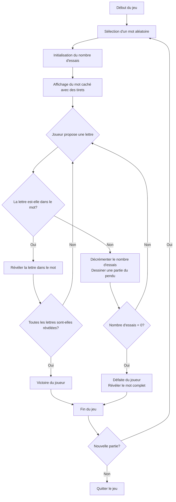

# Logique du pendu

```python
import random

def choisir_mot():
    """Choisit un mot aléatoire dans une liste prédéfinie."""
    mots = ['python', 'programmation', 'ordinateur', 'algorithmique', 'developpement',
            'intelligence', 'application', 'interface', 'variable', 'fonction']
    return random.choice(mots)

def afficher_pendu(erreurs):
    """Affiche l'état actuel du pendu en fonction du nombre d'erreurs."""
    etapes = [
        """
        -----
        |   |
        |
        |
        |
        |
        ---------
        """,
        """
        -----
        |   |
        |   O
        |
        |
        |
        ---------
        """,
        """
        -----
        |   |
        |   O
        |   |
        |
        |
        ---------
        """,
        """
        -----
        |   |
        |   O
        |  /|
        |
        |
        ---------
        """,
        """
        -----
        |   |
        |   O
        |  /|\\
        |
        |
        ---------
        """,
        """
        -----
        |   |
        |   O
        |  /|\\
        |  /
        |
        ---------
        """,
        """
        -----
        |   |
        |   O
        |  /|\\
        |  / \\
        |
        ---------
        """
    ]
    return etapes[min(erreurs, len(etapes) - 1)]

def jouer_pendu():
    """Fonction principale du jeu du pendu."""
    mot = choisir_mot()
    lettres_trouvees = set()
    lettres_proposees = set()
    erreurs = 0
    max_erreurs = 6
    
    print("Bienvenue au jeu du Pendu!")
    
    while erreurs < max_erreurs:
        # Afficher l'état actuel
        print(afficher_pendu(erreurs))
        
        # Afficher le mot avec les lettres trouvées
        mot_affiche = ""
        for lettre in mot:
            if lettre in lettres_trouvees:
                mot_affiche += lettre + " "
            else:
                mot_affiche += "_ "
        print("Mot:", mot_affiche)
        print(f"Erreurs: {erreurs}/{max_erreurs}")
        print("Lettres proposées:", ", ".join(sorted(lettres_proposees)))
        
        # Vérifier si le joueur a gagné
        if all(lettre in lettres_trouvees for lettre in mot):
            print("\nFélicitations! Vous avez trouvé le mot:", mot)
            return
        
        # Demander une lettre
        lettre = input("\nProposez une lettre: ").lower()
        
        # Vérifier si la lettre est valide
        if len(lettre) != 1 or not lettre.isalpha():
            print("Veuillez entrer une seule lettre!")
            continue
        
        # Vérifier si la lettre a déjà été proposée
        if lettre in lettres_proposees:
            print("Vous avez déjà proposé cette lettre!")
            continue
        
        # Ajouter la lettre aux lettres proposées
        lettres_proposees.add(lettre)
        
        # Vérifier si la lettre est dans le mot
        if lettre in mot:
            lettres_trouvees.add(lettre)
            print("Bonne lettre!")
        else:
            erreurs += 1
            print("Mauvaise lettre!")
    
    # Si on arrive ici, c'est que le joueur a perdu
    print(afficher_pendu(erreurs))
    print(f"\nDommage! Vous avez perdu. Le mot était: {mot}")

# Lancer le jeu
if __name__ == "__main__":
    jouer_pendu()
    
    # Demander si le joueur veut rejouer
    while input("Voulez-vous rejouer? (o/n): ").lower() == 'o':
        jouer_pendu()
    
    print("Merci d'avoir joué!")
```