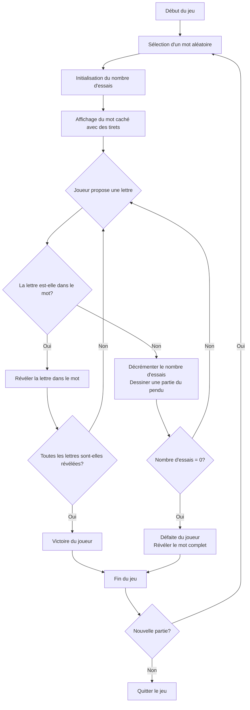

# Logique du pendu

```mermaid
flowchart TD
    A[Début du jeu] --> B[Sélection d'un mot aléatoire]
    B --> C[Initialisation du nombre d'essais]
    C --> D[Affichage du mot caché avec des tirets]
    D --> E{Joueur propose une lettre}
    
    E --> F{La lettre est-elle dans le mot?}
    F -->|Oui| G[Révéler la lettre dans le mot]
    F -->|Non| H[Décrémenter le nombre d'essais\nDessiner une partie du pendu]
    
    G --> I{Toutes les lettres sont-elles révélées?}
    I -->|Oui| J[Victoire du joueur]
    I -->|Non| E
    
    H --> K{Nombre d'essais = 0?}
    K -->|Oui| L[Défaite du joueur\nRévéler le mot complet]
    K -->|Non| E
    
    J --> M[Fin du jeu]
    L --> M
    
    M --> N{Nouvelle partie?}
    N -->|Oui| B
    N -->|Non| O[Quitter le jeu]
```